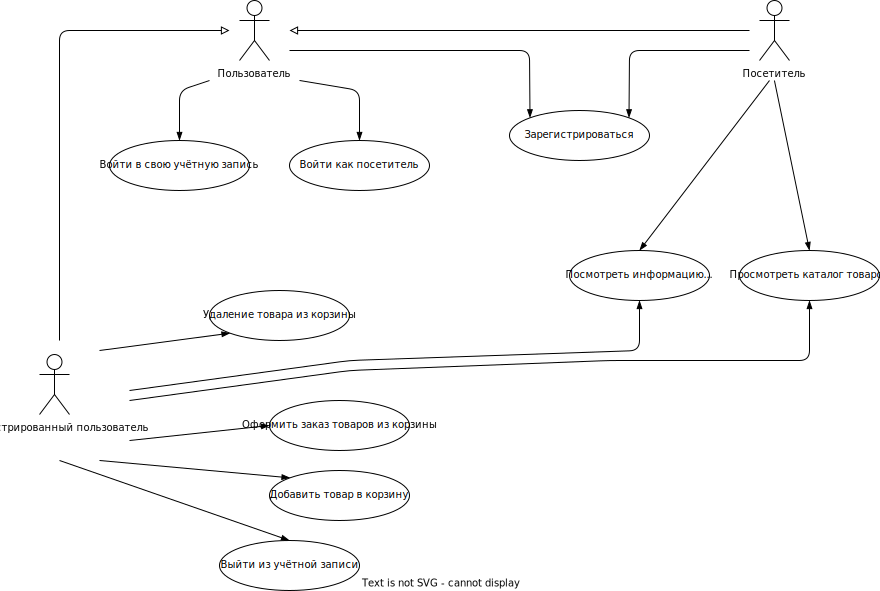

# Диаграмма вариантов использования

</img>

# Глоссарий

| Термин                          | Определение                                           |
| :------------------------------ | :---------------------------------------------------- |
| Пользователь                    | Человек, использующий приложение                      |
| Зарегистрированный пользователь | Пользователь, ранее зарегистрировавшийся в приложении |
| Посетитель                      | Пользователь, использующий приложение без авторизации |

# Поток событий

# Содержание

1 [Актёры](#actors)  
2 [Варианты использования](#use_case)  
2.1 [Войти в свою учётную запись](#sign_in)  
2.2 [Зарегистрироваться](#sign_up)  
2.3 [Посмотреть информацию о товаре](#view_product_information)  
2.4 [Просмотреть каталог товаров](#view_product_list)  
2.5 [Добавить товар в корзину](#add_to_cart)  
2.6 [Удалить товар из корзины](#delete_from_cart)  
2.7 [Оформить заказ товаров из корзины](#order_cart)  
2.8 [Выйти из учетной записи](#sign_out)

# 1 Актёры

| Актёр                           | Описание                                                          |
| :------------------------------ | :---------------------------------------------------------------- |
| Пользователь                    | Человек, использующий приложение                                  |
| Посетитель                      | Пользователь, который использует приложение без регистрации в нём |
| Зарегистрированный пользователь | Пользователь, который зарегистрировался в приложении              |

# 2 Варианты использования

## 2.1 Войти в свою учётную запись

**Описание.** Вариант использования "Войти в свою учётную запись" позволяет пользователю войти в учётную запись.  
**Предусловия.** Пользователь выбрал способ "Sign in" для входа в приложение.  
**Основной поток.**

1. Приложение отображает окно входа в учётную запись;
2. Пользователь вводит своё имя в окно ввода;
3. Пользователь вводит пароль в окно ввода;
4. Приложение авторизует пользователя;
5. Приложение перенаправляет пользователя на главную страницу;
6. Вариант использования завершается.

**Дополнительная информация.** Пользователь имеет возможность отменить действие до ввода. В случае отмены выполняется альтернативный поток А1.

**Альтернативный поток А1.**

1. Приложение скрывает окно входа в учётную запись;
2. Вариант использования завершается досрочно.

## 2.2 Зарегистрироваться

**Описание.** Вариант использования "Зарегистрироваться" позволяет пользователю создать свою учётную запись в приложении.  
**Предусловия.** Пользователь выбрал способ "Sign up" для входа в приложение или посетитель выразил желание зарегистрироваться в приложении, выбрав пункт меню "Sign up".  
**Основной поток.**

1. Приложение отображает окно регистрации, в котором запрашивает у пользователя ввод имени пользователя, пароля, ФИО, электронной почты, номер телефона;
2. Пользователь вводит своё имя пользователя, пароль, ФИО, электронную почту, контактный номер телефона;
3. Пользователь подтверждает ввод данных;
4. Приложение проверяет введённое имя на совпадение с именами уже зарегистрированных пользователей. Если совпадение выявлено, выполняется альтернативный поток А2;
5. Приложение создает пользователя в базе данных;
6. Приложение присваивает пользователю статус "не активирован";
7. Приложение скрывает окно регистрации;
8. Вариант использования завершается.

**Альтернативный поток А2.**

1. Приложение сообщает пользователю, что пользователь с таким именем уже существует;
2. Приложение запрашивает у пользователя ввод другого имени;
3. Возврат к п.2 основного потока.

**Дополнительная информация.** Пользователь имеет возможность отменить действие до подтверждения ввода данных. В случае отмены выполняется альтернативный поток А3.

**Альтернативный поток А3.**

1. Приложение скрывает окно регистрации;
2. Вариант использования завершается досрочно.

## 2.3 Посмотреть информацию о товаре

**Описание.** Вариант использования "Посмотреть информацию о товаре" позволяет пользователю узнать полную информацию о желаемом товаре.  
**Основной поток.**

1. Пользователь нажимает на изображение желаемого товара;
2. На экране появляется всплывающее окно содержащее полную информацию о товаре;
3. Вариант использования завершается.

## 2.4 Просмотреть каталог товаров

**Описание.** Вариант использования "Просмотреть каталог товаров" загружает информацию о товарах в магазине.  
**Основной поток.**

1. Приложение получает список товаров в наличии;
2. Приложение отображает товары на главной странице приложения. Если список пуст, выполняется альтернативный поток А4;
3. Вариант использования завершается.

**Альтернативный поток А4.**

1. Приложение отображает сообщение об отсутствии товаров в наличии;
2. Вариант использования завершается.

## 2.5 Добавить товар в корзину

**Описание.** Вариант использования "Добавить товар в корзину" добавляет товар в корзину пользователя.  
**Предусловия.** Пользователь авторизован в приложении.  
**Основной поток.**

1. Приложение отображает список товаров в магазине;
2. Пользователь выбирает необходимой товар, нажимает на кнопку 'X' после чего товар добавляется в корзину;
3. Вариант использования завершается.

## 2.6 Удалить товар из корзины

**Описание.** Вариант использования "Удалить товар из корзины" позволяет убрать товар из корзины.
**Предусловия.** Пользователь авторизован в приложении.  
**Основной поток.**

1. Приложение получает список товаров в корзине пользователя;
2. Пользователь нажимает на кнопку удаления товара, после чего товар удаляется из корзины;
3. Вариант использования завершается.

## 2.7 Оформить заказ товаров из корзины

**Описание.** Вариант использования "Просмотреть информацию о фильме" отображает полную информацию о фильме.  
**Предусловия.** Пользователь авторизован в приложении.  
**Основной поток.**

1. Вариант использования начинается, когда пользователь нажмёт на кнопку "Оформить заказ";
2. Приложение отправляет список товаров из корзины на сервер;
3. На сервере сохраняется информация об данном заказе;
4. Вариант использования завершается.

## 2.8 Выйти из учетной записи

**Описание.** Вариант использования "Выйти из учётной записи" позволяет зарегистрированному пользователю выйти из учётной записи.  
**Предусловия.** Зарегистрированный пользователь нажал на кнопку "Sign out".  
**Основной поток.**

1. Вариант использования начинается, когда зарегистрированный пользователь выбирает пункт меню "Sign out" на главном окне приложения;
2. Приложение скрывает главное окно приложения;
3. Приложение отображает окно входа в приложение;
4. Вариант использования завершается.
