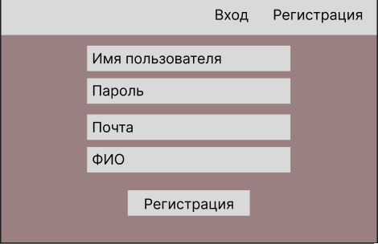
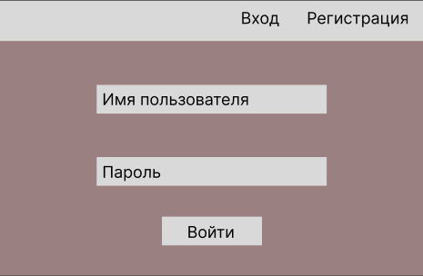
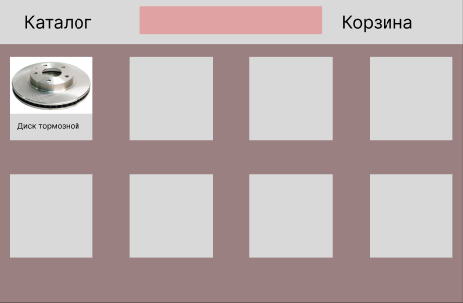
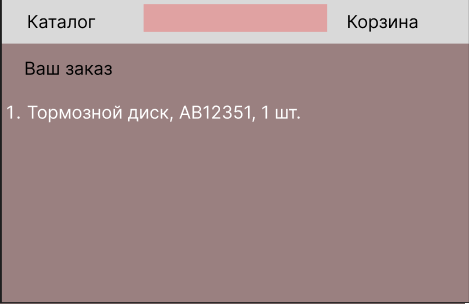
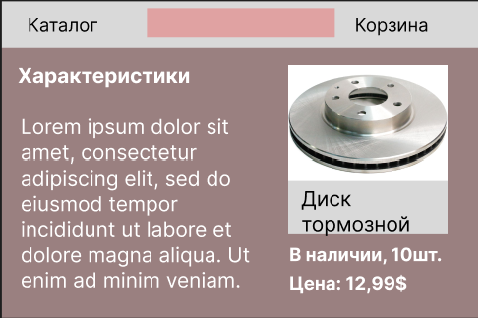

# Система интернет-заказов у поставщика автозапчастей

- Шарамета Артур 150502
- Максимчик Егор 150502

#  Введение

## Содержание

[1.1 Назначение](#11-назначение)  
[1.2 Границы проекта](#12-границы-проекта)  
[2.1 Программные требования](#21-программные)  
[2.2 Интерфейс пользователя](#22-интерфейс-пользователя)  
[2.3 Характеристика пользователя](#23-характеристика-пользователя)  
[2.4 Предположения и зависимости](#24-предположения-и-зависимости)  
[3.1 Функциональные требования](#31-функуциональные-требования)  
[3.2 Нефункциональные требования](#32-нефункциональные-требования)  
[3.2.1 Безопасность системы](#321-безопасность-системы)  
[3.2.2 Надёжность системы](#322-надёжность-системы)  
[3.2.3 Ограничения](#323-ограничения)  

## 1.1 Назначение

В этом документе будут описаны функциональные и нефункциональные треубования к веб-приложению "Система интернет-заказов у поставщика автозапчастей". Этот документ предназначен для команды, которая будет реализовывать и проверять корректность работы приложения.

## 1.2 Границы проекта

Приложение без обязательной регистрации позволит пользователям просматривать каталог товаров в наличии.

Для регистрации в приложении пользователю необходимо иметь электронную почту для подтверждения регистрации.

В приложении будет необходима обязательная регистрация для полного доступа к функционалу, например, заказу автозапчастей. 

# Требование пользователя

## 2.1 Программные 

Стек технологий:
- Spring Boot
    - Web
    - Security
    - MVC
    - Mail Sender
    - Eureka discovery service
    - JPA
    - Bean Validation API
    - Kafka
- PostgreSQL
- Docker
- MinIO
- React/Angular 

## 2.2 Интерфейс пользователя

Для взаимодействия с пользователем будут использоваться веб-страницы (HTML/JavaScript/CSS).

## Регистрация

## Вход

## Каталог

## Корзина

## Страницы с товаром

## 2.3 Характеристика пользователей

| Класс пользователей             | Описание                                                                                                                        |
|:--------------------------------|:--------------------------------------------------------------------------------------------------------------------------------|
| Анонимные пользователи          | Пользователи, которые не хотят регистрироваться в приложении. Имеют доступ к частичному функционалу - просмотр каталога товаров.                            |
| Зарегистрированные пользователи | Пользователи, которые вошли в приложение под своим аккаунтом. Имеют доступ к полному функционалу - заказ товаров, просмотр каталога, мониторинг заказанных товаров.  |
| Администратор                   | Пользователи, которые имеют полный доступ ко всему функционалу. Могут добавлять и удалять товары из каталога.                         |

## 2.4 Предположения и зависимости

1. Приложение работает только при подключении к интернету;
2. Приложение позволяет заказывать товар только если он есть в наличии.

# Системные требования

## 3.1 Функциональные требования

- Просмотр каталога товаров
- Просмотр описания товаров
- Заказ товаров
- Добавление товаров
- Удаление товаров

## 3.2 Нефункциональные требования

### 3.2.1 Безопасность системы
1. Использование JWT токенов для аутенфикации пользователей и администраторов;
2. Использование MVC архитектуры при разработке приложения, для разделения бизнес-логики.

### 3.2.2 Надёжность системы
1. Eureka перезагружает микросервис если при его работе возникли ошибки приводящие к завершению работы;
2. Docker перезагружает приложение или базу-данных если при их работе возникли ошибки.
 
### 3.2.3 Ограничения
1. Приложение работает только при подключении к интернету;
2. Приложение позволяет заказывать товар только если он есть в наличии.
